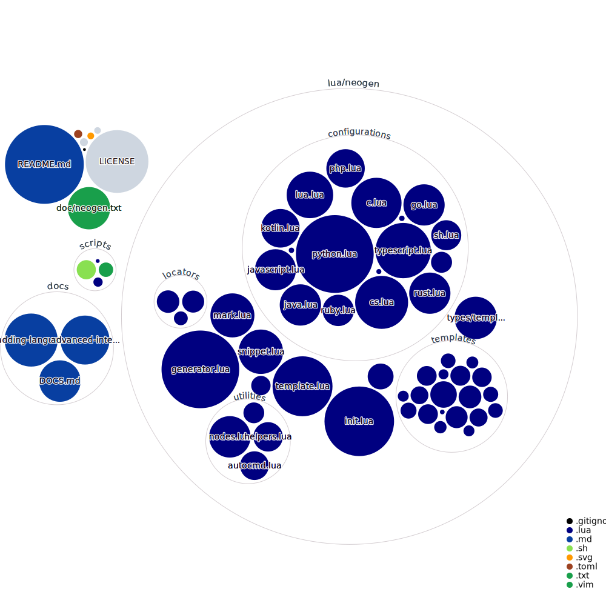

<div align="center">
<br>

# Neogen - Your Annotation Toolkit

[](https://neovim.io)
[](http://www.lua.org)

</div>

# Table Of Contents

- [Features](#features)
- [Requirements](#requirements)
- [Installation](#installation)
- [Usage](#usage)
- [Configuration](#configuration)
- [Supported Languages](#supported-languages)
- [Adding Languages](#adding-languages)
- [GIFS](#gifs)
- [Credits](#credits)
- [Support](#support)

## Features

- Create annotations with one keybind, and jump your cursor in the inserted annotation
- Defaults for multiple languages and annotation conventions
- Extremely customizable and extensible
- Written in lua (and uses Tree-sitter)


## Requirements

Have Tree-sitter parsers installed on your system. For more information, check out the [:treesitter-parsers](https://neovim.io/doc/user/treesitter.html#treesitter-parsers) neovim help page.

## Installation

Use your favorite package manager to install Neogen, e.g:

###  Lazy

```lua
{ 
    "danymat/neogen", 
    config = true,
    -- Uncomment next line if you want to follow only stable versions
    -- version = "*" 
}
```

### Packer

```lua
use {
    "danymat/neogen",
    config = function()
        require('neogen').setup {}
    end,
    -- Uncomment next line if you want to follow only stable versions
    -- tag = "*"
}
```

## Usage

- If you want to keep it simple, you can use the `:Neogen` command:

```vim
" will generate annotation for the function, class or other relevant type you're currently in
:Neogen
" or you can force a certain type of annotation with `:Neogen <TYPE>`
" It'll find the next upper node that matches the type `TYPE`
" E.g if you're on a method of a class and do `:Neogen class`, it'll find the class declaration and generate the annotation.
:Neogen func|class|type|...
```

- If you like to use the lua API, I exposed a function to generate the annotations.

```lua
require('neogen').generate()
```

You can bind it to your keybind of choice, like so:

```lua
local opts = { noremap = true, silent = true }
vim.api.nvim_set_keymap("n", "<Leader>nf", ":lua require('neogen').generate()<CR>", opts)
```

Calling the `generate` function without any parameters will try to generate annotations for the current function.

You can provide some options for the generate, like so:

```lua
require('neogen').generate({
    type = "func" -- the annotation type to generate. Currently supported: func, class, type, file
})
```

For example, I can add an other keybind to generate class annotations:

```lua
local opts = { noremap = true, silent = true }
vim.api.nvim_set_keymap("n", "<Leader>nc", ":lua require('neogen').generate({ type = 'class' })<CR>", opts)
```

### Snippet support

We added snippet support, and we provide defaults for some snippet engines.
And this is done via the `snippet_engine` option in neogen's setup:

- `snippet_engine` option will use provided engine to place the annotations:

Currently supported: `luasnip`, `snippy`, `vsnip`, `nvim`, `mini`.

```lua
require('neogen').setup({ snippet_engine = "luasnip" })
```

That's all ! You can now use your favorite snippet engine to control the annotation, like jumping between placeholders.

Or, if you want to return the snippet as a string (to integrate with other snippet engines, for example),
you can do it by using the `return_snippet` option in the `generate` function:

- `return_snippet` option will return the annotations as lsp snippets.

```lua
local snippet, row, col = require('neogen').generate({ snippet_engine = "luasnip" })
```

And then pass the snippet to the plugin's snippet expansion function.

### Default cycling support

_Note that this part is only useful if you don't use the snippets integration._

If you don't want to use a snippet engine with Neogen, you can leverage Neogen's native jumps between placeholders.
To map some keys to the cycling feature, you can do like so:

```lua
local opts = { noremap = true, silent = true }
vim.api.nvim_set_keymap("i", "<C-l>", ":lua require('neogen').jump_next<CR>", opts)
vim.api.nvim_set_keymap("i", "<C-h>", ":lua require('neogen').jump_prev<CR>", opts)
```

Or, if you want to use a key that's already used for completion purposes, take a look at the code snippet here:

<details>
   <summary>nvim-cmp</summary>

```lua
local cmp = require('cmp')
local neogen = require('neogen')

cmp.setup {
    ...

    -- You must set mapping if you want.
    mapping = {
        ["<tab>"] = cmp.mapping(function(fallback)
            if neogen.jumpable() then
                neogen.jump_next()
            else
                fallback()
            end
        end, {
            "i",
            "s",
        }),
        ["<S-tab>"] = cmp.mapping(function(fallback)
            if neogen.jumpable(true) then
                neogen.jump_prev()
            else
                fallback()
            end
        end, {
            "i",
            "s",
        }),
    },
    ...
}
```

  </details>

## Configuration

```lua
require('neogen').setup {
    enabled = true,             --if you want to disable Neogen
    input_after_comment = true, -- (default: true) automatic jump (with insert mode) on inserted annotation
    -- jump_map = "<C-e>"       -- (DROPPED SUPPORT, see [here](#cycle-between-annotations) !) The keymap in order to jump in the annotation fields (in insert mode)
}
```

If you're not satisfied with the default configuration for a language, you can change the defaults like this:

```lua
require('neogen').setup {
    enabled = true,
    languages = {
        lua = {
            template = {
                annotation_convention = "emmylua" -- for a full list of annotation_conventions, see supported-languages below,
                ... -- for more template configurations, see the language's configuration file in configurations/{lang}.lua
                }
        },
        ...
    }
}
```

For example, if you want to quickly add support for new filetypes based around existing ones, you can do like this:

```lua
require('neogen').setup({
    languages = {
        ['cpp.doxygen'] = require('neogen.configurations.cpp')
    }
})
```

## Supported Languages

There is a list of supported languages and fields, with their annotation style

| Languages       | Annotation Conventions                                                                                                                                                                                                                                                           | Supported annotation types      |
| --------------- | -------------------------------------------------------------------------------------------------------------------------------------------------------------------------------------------------------------------------------------------------------------------------------- | ------------------------------- |
| sh              | [Google Style Guide](https://google.github.io/styleguide/shellguide.html) (`"google_bash"`)                                                                                                                                                                                      | `func`, `file`                  |
| c               | [Doxygen](https://www.doxygen.nl/manual/commands.html) (`"doxygen"`)                                                                                                                                                                                                             | `func`, `file`, `type`          |
| cs              | [Xmldoc](https://docs.microsoft.com/fr-fr/dotnet/csharp/language-reference/xmldoc/) (`"xmldoc"`) <br> [Doxygen](https://www.doxygen.nl/manual/commands.html) (`"doxygen"`)                                                                                                       | `func`, `file`, `class`         |
| cpp             | [Doxygen](https://www.doxygen.nl/manual/commands.html) (`"doxygen"`)                                                                                                                                                                                                             | `func`, `file`, `class`         |
| go              | [GoDoc](https://go.dev/blog/godoc) (`"godoc"`)                                                                                                                                                                                                                                   | `func`, `type`                  |
| java            | [Javadoc](https://docs.oracle.com/javase/1.5.0/docs/tooldocs/windows/javadoc.html#documentationcomments) (`"javadoc`)                                                                                                                                                            | `func`, `class`, `type`         |
| javascript      | [JSDoc](https://jsdoc.app) (`"jsdoc"`)                                                                                                                                                                                                                                           | `func`, `class`, `type`, `file` |
| javascriptreact | [JSDoc](https://jsdoc.app) (`"jsdoc"`)                                                                                                                                                                                                                                           | `func`, `class`, `type`, `file` |
| julia             | [Julia](https://docs.julialang.org/en/v1/manual/documentation/#Writing-Documentation) (`"julia"`)                                                                                                                                                                                                                                            | `func`, `class` |
| kotlin          | [KDoc](https://kotlinlang.org/docs/kotlin-doc.html) (`"kdoc"`)                                                                                                                                                                                                                   | `func`, `class`                 |
| lua             | [Emmylua](https://emmylua.github.io/) (`"emmylua"`)<br> [Ldoc](https://stevedonovan.github.io/ldoc/manual/doc.md.html) (`"ldoc"`)                                                                                                                                                | `func`, `class`, `type`, `file` |
| php             | [Php-doc](https://docs.phpdoc.org/3.0/guide/references/phpdoc/index.html) (`"phpdoc"`)                                                                                                                                                                                           | `func`, `type`, `class`         |
| python          | [Google docstrings](https://google.github.io/styleguide/pyguide.html) (`"google_docstrings"`) <br> [Numpydoc](https://numpydoc.readthedocs.io/en/latest/format.html) (`"numpydoc"`) <br> [reST](https://sphinx-rtd-tutorial.readthedocs.io/en/latest/docstrings.html) (`"reST"`) | `func`, `class`, `type`, `file` |
| ruby            | [YARD](https://yardoc.org/index.html) (`"yard"`) <br> [Rdoc](https://github.com/ruby/rdoc) (`"rdoc"`) <br> [Tomdoc](http://tomdoc.org) (`"tomdoc"`)                                                                                                                              | `func`, `type`, `class`         |
| rust            | [RustDoc](https://doc.rust-lang.org/rustdoc/what-is-rustdoc.html) (`"rustdoc"`) <br> [Alternative](https://stackoverflow.com/questions/30009650/how-do-you-document-function-arguments) (`"rust_alternative"`)                                                                   | `func`, `file`, `class`         |
| typescript      | [JSDoc](https://jsdoc.app) (`"jsdoc"`) <br> [TSDoc](https://tsdoc.org) (`"tsdoc"`)                                                                                                                                                                                               | `func`, `class`, `type`, `file` |
| typescriptreact | [JSDoc](https://jsdoc.app) (`"jsdoc"`) <br> [TSDoc](https://tsdoc.org) (`"tsdoc"`)                                                                                                                                                                                               | `func`, `class`, `type`, `file` |
| vue             | [JSDoc](https://jsdoc.app) (`"jsdoc"`)                                                                                                                                                                                                                                           | `func`, `class`, `type`, `file` |

## Adding Languages

1. Using the defaults to generate a new language support: [Adding Languages](./docs/adding-languages.md)
2. (advanced) Only if the defaults aren't enough, please see here: [Advanced Integration](./docs/advanced-integration.md)

Tip: Take a look at this beatiful diagram, showing a representation of the codebase. You can then take a first understanding of what is under the hood. For more details, you can see `:h neogen-develop`.
    


## Tests
Run tests using this command

```sh
make test
```

## GIFS


## Credits

- Binx, for making that gorgeous logo for free!
  - [Github](https://github.com/Binx-Codes/)
  - [Reddit](https://www.reddit.com/u/binxatmachine)

## Support

You like my plugin and want to express your gratitude 👼 ? You can suppport me by donating the equivalent of my morning coffee (no minimum required). I would really appreciate your support as it can motivate me to continue this journey 💝

- [Donate here](https://github.com/sponsors/danymat)
