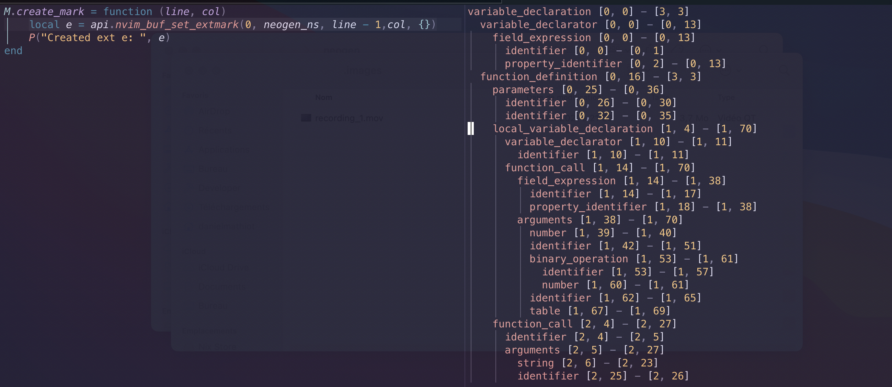

# Adding Languages - Simplified

This sections aims to simplify the languages addition, without exposing the inner workings of neogen, but only showing the quickest way to add support to a language.

For this, I will do a very quick recap about the backend concepts of Neogen. Pay careful attention to this, because I will explain what the defaults are, so you can use them.

## Backend Summary

I will use the lua configuration file [here](../lua/neogen/configurations/lua.lua) to explain the inner workings of the backend, so feel free to open a new tab and switch to it regularly.

### Locator

#### Concept

The locator is a function responsible for finding the most appropriate parent for annotation purposes

#### Default Locator

The default locator will fetch the node in current cursor position, and try to go to each parent node recursively until it finds a node name present in `parents[<class|func|type>]`.

Example (with Tree-sitter activated on the side for better comprehension):



The current cursor position is located in the middle of the function (`local_variable_declaration`).

If I generate a function annotation using neogen, the default locator will try to find the first parent node matching one of those:

```lua
func = { "function", "local_function", "local_variable_declaration", "field", "variable_declaration" },
```

which will be `variable_declaration`. The parent node will now be this node.

### Granulator

### Concept

The granulator is a function that will try to fetch all desired information from a parent node.

### Default Granulator

The default granulator will use data format like this one:

```lua
data = {
    func = {
        -- When the function is inside one of those
        ["local_variable_declaration|field|variable_declaration"] = {
            ["2"] = {
                match = "function_definition",

                extract = common_function_extractor,
            },
        },
        -- When the function is in the root tree
        ["function_definition|function|local_function"] = {
            ["0"] = {

                extract = common_function_extractor,
            },
        },
    },
    ...
}
```

This means in our example, that we found a parent node called `variable_declaration`. It'll fetch this data:

```lua
["local_variable_declaration|field|variable_declaration"] = {
    ["2"] = {
        match = "function_definition",

        extract = common_function_extractor,
    },
},
```

This snippet means: From the parent node, try to execute the `extract` function from the second child called `function_definition`.

The extract function is important. It's where you'll parse the nodes and create a table corresponding to the found content.

This is the extract function for lua functions:

```lua
local common_function_extractor = function(node)
    local tree = {
        {
            retrieve = "first",
            node_type = "parameters",
            subtree = {
                { retrieve = "all", node_type = "identifier", extract = true },
                { retrieve = "all", node_type = "spread", extract = true },
            },
        },
        { retrieve = "first", node_type = "return_statement", extract = true },
    }

    local nodes = neogen.utilities.nodes:matching_nodes_from(node, tree)
    local res = neogen.utilities.extractors:extract_from_matched(nodes)

    return {
        parameters = res.identifier,
        vararg = res.spread,
        return_statement = res.return_statement,
    }
end
```

I exposed a function called `neogen.utilities.nodes:matching_nodes_from` which will try to generate a table of nodes following a tree

The tree in this example is very simple: from the node called `function_definition`, do:
- Retrieve the first node called `return_statement` and extract it
- From the first node called `parameters`, try to extract all nodes with name `identifier` and `spread`

The `neogen.utilities.extractors:extract_from_matched` takes the nodes table returned by the first function and will return a table containing the content of the nodes.

The granulator then returns the table you want with the extracted values you want

### Generator

#### Concept

The generator will use the template provided in the language configuration and the extracted values from the granulator in order to create the annotations to be placed on the desired place.

#### Default Generator

The default generator uses a template format like this:

```lua
template = {
    -- Which annotation convention to use
    annotation_convention = "emmylua",
    emmylua = {
        { nil, "- $1", { type = { "class", "func" } } }, -- add this string only on requested types
        { nil, "- $1", { no_results = true } }, -- Shows only when there's no results from the granulator
        { "parameters", "- @param %s $1|any" },
        { "vararg", "- @vararg $1|any" },
        { "return_statement", "- @return $1|any" },
        { "class_name", "- @class $1|any" },
        { "type", "- @type %s $1" },
    },
    ldoc = {
        { nil, "- $1", { no_results = true, type = { "func" } } },
        { nil, "- $1", { type = { "func" } } },
        { "parameters", " @tparam $1|any %s " },
        { "return_statement", " @treturn $1|any" },
    },
},
```

- The `annotation_convention` field will use the desired annotation template.
- Adding `use_default_comment = false` will not prepend the language's default comment before the template
- If you want to customize the position of the annotated text, you can add `append = { position = "<before|after>", child_name = "<node_name>"}`

An annotation template is a set of tables, each one composed of 2 required params, and 1 optional table

- the name inside the granulator returned table
- the template to be formatted each time there is a value in the returned table from the granulator:
    - Specifying `%s` will use the value from the table
    - Adding `$1` will move the cursor there (with tab completion) if the user allowed it in the setup function
- the optional params: 
    - `no_results`: (bool, default false) will only use this field when there is no value returned by the granulator
    - `type`: (string[], default nil) will only use this field for the required types. If not specified, it will use this field for all types
    - `before_first_item`: (string[], default nil) will append the lines before the first found item for the table
